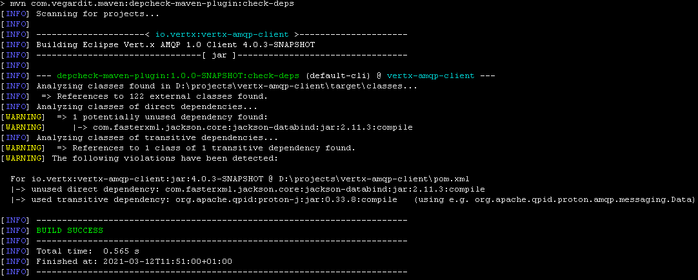
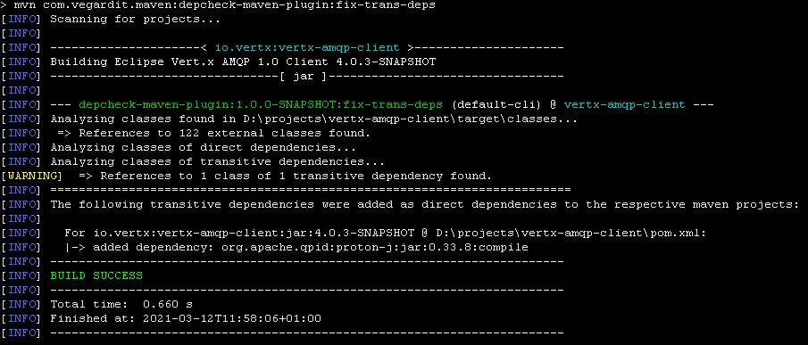
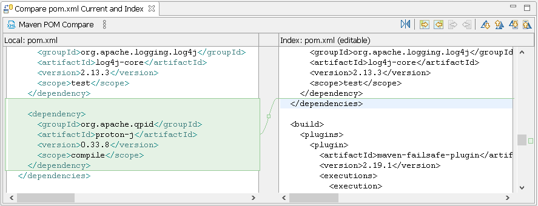

# depcheck-maven-plugin

[](https://github.com/vegardit/depcheck-maven-plugin/actions?query=workflow%3A%22Build%22)
[](LICENSE.txt)
[](CHANGELOG.md)
[](https://codeclimate.com/github/vegardit/depcheck-maven-plugin/maintainability)
[](CODE_OF_CONDUCT.md)
[](https://search.maven.org/artifact/com.vegardit.maven/depcheck-maven-plugin)

1. [What is it?](#what-is-it)
1. [Usage](#usage)
1. [License](#license)


## <a name="what-is-it"></a>What is it?

Pragmatic [Maven](https://maven.apache.org) plugin to check for unused direct and used indirect (transitive) dependencies.


## <a name="usage"></a>Usage


### Ad-hoc execution via the command line

To execute the latest release of this plugin via the command line change into a maven project.

#### The "check-deps" Maven goal

```sh
mvn com.vegardit.maven:depcheck-maven-plugin:check-deps
```

This runs the `check-deps` goal that scans the project and reports dependency issues.




#### The "fix-trans-deps" Maven goal

This goal scans the project for references to classes of transitive dependencies and adds
the respective dependencies as direct dependencies to the pom.xml






#### The "help" Maven goal

To display the online help run:
```sh
# display available goals
mvn com.vegardit.maven:depcheck-maven-plugin:help

# display parameters of check-deps
mvn com.vegardit.maven:depcheck-maven-plugin:help -Ddetail=true -Dgoal=check-deps

# display parameters of fix-trans-deps
mvn com.vegardit.maven:depcheck-maven-plugin:help -Ddetail=true -Dgoal=fix-trans-deps
```


### Automated execution during Maven build

Add the following to your pom.xml and adjust the configuration to your requirements.
Since the plugin performs a byte code analysis it must be executed in a Maven phase after the `compile` phase, see the [Maven Default Lifecycle](https://maven.apache.org/ref/3.6.3/maven-core/lifecycles.html#default_Lifecycle) for possible phases. We recommend using `pre-package`.

```xml
<project>

  <!-- ... other settings ... -->

  <plugins>
    <plugin>
      <groupId>com.vegardit.maven</groupId>
      <artifactId>depcheck-maven-plugin</artifactId>
      <version>[VERSION_GOES_HERE]</version>
      <executions>
        <execution>
          <id>check-deps@pre-package</phase>
          <phase>pre-package</phase>
          <goals>
            <goal>check-deps</goal>
          </goals>
          <configuration>
            <skip>false</skip>

            <!-- check if classes of transitive dependencies are used in this project directly -->
            <checkForUsedTransitiveDependencies>true</checkForUsedTransitiveDependencies>
            <failIfUsedTransitiveDependencies>true</failIfUsedTransitiveDependencies>

            <!-- check if some of the declared direct dependencies are potentially unused -->
            <checkForUnusedDependencies>true</checkForUnusedDependencies>
            <failIfUnusedDependencies>false</failIfUnusedDependencies>

            <!-- for multi module projects - abort build after first module with violations -->
            <failFast>true</failFast>

            <verbose>false</verbose>
          </configuration>
        </execution>
      </executions>
    </plugin>
  </plugins>
</project>
```


### Binaries

**Release** binaries of this project are available at Maven Central https://search.maven.org/artifact/com.vegardit.maven/depcheck-maven-plugin

**Snapshot** binaries are available via the [mvn-snapshots-repo](https://github.com/vegardit/depcheck-maven-plugin/tree/mvn-snapshots-repo) git branch. You need to add this repository configuration to your Maven `settings.xml`:

```xml
<?xml version="1.0" encoding="UTF-8" ?>
<settings>
  <profiles>
    <profile>
      <repositories>
        <repository>
          <id>depcheck-maven-plugin-snapshots</id>
          <name>depcheck-maven-plugin-snapshots</name>
          <url>https://raw.githubusercontent.com/vegardit/depcheck-maven-plugin/mvn-snapshots-repo</url>
          <releases><enabled>false</enabled></releases>
          <snapshots><enabled>true</enabled></snapshots>
        </repository>
      </repositories>
    </profile>
  </profiles>
  <activeProfiles>
    <activeProfile>depcheck-maven-plugin-snapshots</activeProfile>
  </activeProfiles>
</settings>
```


## <a name="license"></a>License

All files are released under the [Apache License 2.0](LICENSE.txt).

Individual files contain the following tag instead of the full license text:
```
SPDX-License-Identifier: Apache-2.0
```

This enables machine processing of license information based on the SPDX License Identifiers that are available here: https://spdx.org/licenses/.
